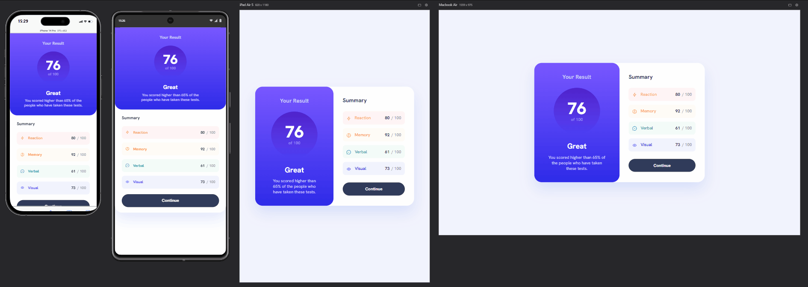

# Result summary component

### Project

This is a static component built with React showing health metrics.

### Screenshot

### Links

- Live Site URL: [Result summary component](https://tomduranti.github.io/result_summary_component/)

### Built with

- React
- Storybook
- Semantic HTML5
- Sass
- CSS Flexbox
- BEM
- Responsive & adaptive design
- Mobile-first workflow

### Further enhancements
1) fetch from a sport API as a JSON file
